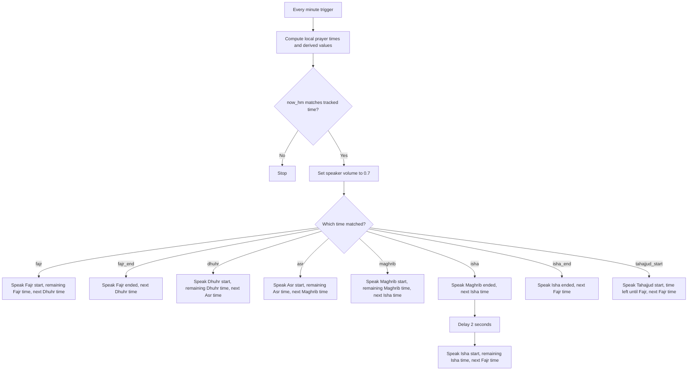

# Namaz Announcements (Family Room Speaker)

This automation announces Islamic prayer times through your family room speaker using text-to-speech. In addition to announcing the start or end of a prayer window, it also says how much time remains for the active namaz where applicable and when the next namaz will begin.

---

## How It Works

Every minute, the automation compares the current local time to a set of prayer-related times from the Islamic Prayer Times integration plus one calculated time for Tahajjud. If the current minute matches one of those times, the automation raises the speaker volume and plays the matching announcement.

The spoken messages now include:

- The prayer starting now
- How much time is left for that prayer, when that prayer has a defined end
- When the next namaz will begin

## Pseudo Diagram

```text
Every minute
  -> compute now_hm
  -> compute prayer times:
     fajr, sunrise, dhuhr, asr, maghrib, isha, midnight
  -> compute derived values:
     spoken clock times
     prayer durations
     next day's Fajr
     tahajjud_start
  -> is now_hm one of [fajr, fajr_end, dhuhr, asr, maghrib, isha, isha_end, tahajjud_start]?
     -> no: stop
     -> yes:
        -> set speaker volume to 0.7
        -> choose matching time
           -> fajr:
              speak "It is time for Fajr prayer..."
              include remaining Fajr time
              include Dhuhr start time
           -> fajr_end:
              speak "Fajr time has ended..."
              include Dhuhr start time
           -> dhuhr:
              speak "It is time for Dhuhr prayer..."
              include remaining Dhuhr time
              include Asr start time
           -> asr:
              speak "It is time for Asr prayer..."
              include remaining Asr time
              include Maghrib start time
           -> maghrib:
              speak "It is time for Maghrib prayer..."
              include remaining Maghrib time
              include Isha start time
           -> isha:
              speak "Maghrib time has ended..."
              include Isha start time
              wait 2 seconds
              speak "It is time for Isha prayer..."
              include remaining Isha time
              include next Fajr start time
           -> isha_end:
              speak "Isha time has ended..."
              include next Fajr start time
           -> tahajjud_start:
              speak "Tahajjud time has started..."
              include remaining time until Fajr
              include next Fajr start time
```

## Mermaid Diagram



The tracked events are:

- **Fajr** - pre-dawn prayer start
- **Fajr end** - announced at sunrise
- **Dhuhr** - midday prayer start
- **Asr** - afternoon prayer start
- **Maghrib** - sunset prayer start
- **Maghrib end** - announced at Isha time
- **Isha** - night prayer start
- **Isha end** - announced at Islamic midnight
- **Tahajjud start** - calculated as the start of the last third of the night

---

## When It Runs

The automation checks the time **every minute, all day**. It only announces at the exact minute that matches one of the tracked prayer times. All other minutes are ignored.

---

## Requirements

### Integrations

| Integration | Purpose |
|---|---|
| **Islamic Prayer Times** | Provides the daily prayer time sensors |
| **Google Translate TTS** | Converts the text announcements into spoken audio |

> **Note:** The Islamic Prayer Times integration must be installed and configured in Home Assistant before this automation will work.

### Entities

| Entity | Type | Purpose |
|---|---|---|
| `media_player.family_room_speaker` | Media Player | Speaker used for announcements |
| `sensor.islamic_prayer_times_fajr_prayer` | Sensor | Fajr prayer time |
| `sensor.islamic_prayer_times_sunrise` | Sensor | Sunrise, used as Fajr end |
| `sensor.islamic_prayer_times_dhuhr_prayer` | Sensor | Dhuhr prayer time |
| `sensor.islamic_prayer_times_asr_prayer` | Sensor | Asr prayer time |
| `sensor.islamic_prayer_times_maghrib_prayer` | Sensor | Maghrib prayer time |
| `sensor.islamic_prayer_times_isha_prayer` | Sensor | Isha prayer time |
| `sensor.islamic_prayer_times_midnight` | Sensor | Islamic midnight, used as Isha end and Tahajjud calculation |
| `tts.google_translate_en_com` | TTS Service | Text-to-speech engine |

These prayer time sensors are created automatically by the Islamic Prayer Times integration.

---

## Customizable Settings

The main settings you would usually change are:

| Variable | Current Value | Description |
|---|---|---|
| `speaker` | `media_player.family_room_speaker` | Speaker entity used for playback |
| `vol` | `0.7` | Announcement volume from `0.0` to `1.0` |

Most of the remaining variables in the automation are computed automatically from the prayer time sensors. They include:

- Raw timestamp values for each prayer boundary
- Spoken clock-time values such as `7:24 PM`
- Human-readable duration text such as `2 hours and 15 minutes`
- A calculated `next_fajr_ts` value so late-night announcements can reference the next day's Fajr
- A calculated `tahajjud_start` and `tahajjud_start_ts`

### Changing the Speaker

Update the `speaker` variable if your media player uses a different entity ID.

### Changing the Volume

Update `vol` to adjust the announcement loudness. The automation sets the speaker to this value before the announcement and does not restore the previous volume afterward.

### Changing the Announcement Language

The automation currently uses `tts.google_translate_en_com` with English phrases. To change the language, update the TTS entity and the message text in the action blocks.

---

## Announcement Behavior

Each trigger point produces the following style of message:

| Trigger | Spoken content |
|---|---|
| `fajr` | Fajr has started, how much time remains for Fajr, and when Dhuhr begins |
| `fajr_end` | Fajr has ended and when Dhuhr begins |
| `dhuhr` | Dhuhr has started, how much time remains for Dhuhr, and when Asr begins |
| `asr` | Asr has started, how much time remains for Asr, and when Maghrib begins |
| `maghrib` | Maghrib has started, how much time remains for Maghrib, and when Isha begins |
| `isha` | First, Maghrib has ended and when Isha begins. Then after 2 seconds, Isha has started, how much time remains for Isha, and when the next Fajr begins |
| `isha_end` | Isha has ended and when the next Fajr begins |
| `tahajjud_start` | Tahajjud has started, how much time remains until Fajr, and when Fajr begins |

---

## Behavior Notes

- **Time zone awareness:** The prayer sensor timestamps are converted to local time before comparisons and announcements are generated.
- **End times used:** Fajr ends at sunrise, Maghrib ends at Isha, and Isha ends at the integration's Islamic midnight.
- **Next-prayer wording:** Each prayer-start message includes the next namaz start time in spoken 12-hour format.
- **Remaining-time wording:** The automation converts timestamp differences into human-readable phrases such as `45 minutes` or `2 hours and 10 minutes`.
- **Back-to-back Isha announcements:** At Isha time, the automation intentionally plays two messages in sequence: one for Maghrib ending and one for Isha beginning.
- **Next-day Fajr handling:** Late-night announcements use a computed next-day Fajr timestamp so the spoken Fajr time remains correct after Isha.
- **Tahajjud calculation:** Tahajjud is calculated as the start of the final third of the night using Maghrib and Islamic midnight.
- **Unavailable sensors:** If a required sensor is `unknown`, `unavailable`, empty, or `none`, the corresponding computed value becomes blank or unavailable and that announcement path may be skipped or produce `unknown` in the spoken text.
- **Single mode:** The automation uses `mode: single`, which prevents overlapping runs.
- **No quiet-hours logic:** The automation can speak at any time of day or night unless you add extra conditions.

---

## Troubleshooting

**The speaker does not announce any prayers.**

- Confirm the Islamic Prayer Times integration is installed and its sensors have valid values in Developer Tools > States.
- Confirm `media_player.family_room_speaker` matches your actual speaker entity.
- Confirm `tts.google_translate_en_com` is available and working.

**Announcements fire at the wrong time.**

- Verify your Home Assistant time zone under **Settings > System > General**.
- Verify the Islamic Prayer Times integration is configured for the correct location and calculation method.

**The message says `unknown` for a prayer time.**

- Check whether the related prayer time sensor is returning a valid timestamp.
- Reload the automation after fixing the sensor state so the templates can evaluate again on the next trigger.

**The speaker volume does not change.**

- Some media player integrations do not support `media_player.volume_set`. Check the entity's supported features in Home Assistant.

---

## Related Files

- [`Namaz_announcements.yml`](Namaz_announcements.yml) - Home Assistant automation definition for these announcements
- [`Westminister_Chime_Clock.yml`](Westminister_Chime_Clock.yml) - Westminster chime automation for the same speaker
