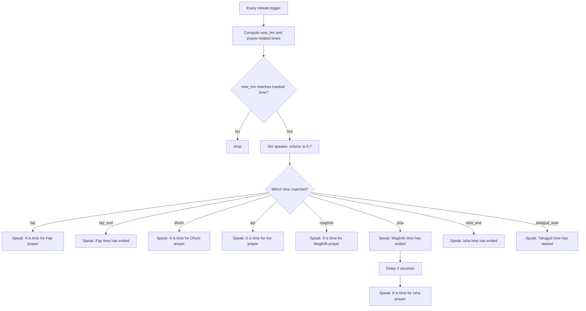

# Namaz Announcements (Family Room Speaker)

This automation announces Islamic prayer times through your family room speaker using text-to-speech. It now covers the start of the five daily prayers, the end of Fajr, Maghrib, and Isha, and the calculated start of Tahajjud.

---

## How It Works

Every minute, the automation checks whether the current time matches any of the tracked prayer-related times retrieved or derived from the Islamic Prayer Times integration. If there is a match, the speaker volume is set to the configured level and a spoken announcement is played.

## Pseudo Diagram

```text
Every minute
  -> compute now_hm and prayer-related times
  -> is now_hm one of [fajr, fajr_end, dhuhr, asr, maghrib, isha, isha_end, tahajjud_start]?
     -> no: stop
     -> yes:
        -> set speaker volume to 0.7
        -> choose matching time
           -> fajr: speak "It is time for Fajr prayer."
           -> fajr_end: speak "Fajr time has ended."
           -> dhuhr: speak "It is time for Dhuhr prayer."
           -> asr: speak "It is time for Asr prayer."
           -> maghrib: speak "It is time for Maghrib prayer."
           -> isha:
              -> speak "Maghrib time has ended."
              -> wait 2 seconds
              -> speak "It is time for Isha prayer."
           -> isha_end: speak "Isha time has ended."
           -> tahajjud_start: speak "Tahajjud time has started."
```

## Mermaid Diagram



The announcements include:

- **Fajr** - pre-dawn prayer
- **Fajr end** - announced at sunrise
- **Dhuhr** - midday prayer
- **Asr** - afternoon prayer
- **Maghrib** - sunset prayer
- **Maghrib end** - announced as a separate notification at Isha
- **Isha** - night prayer
- **Isha end** - announced at Islamic midnight
- **Tahajjud start** - calculated as the start of the last third of the night

---

## When It Runs

The automation checks the time **every minute, all day**. It only plays an announcement at the exact minute that matches a prayer time. On all other minutes, it does nothing.

---

## Requirements

### Integrations

| Integration | Purpose |
|---|---|
| **Islamic Prayer Times** | Provides sensor entities with the daily prayer times |
| **Google Translate TTS** | Converts the announcement text to spoken audio |

> **Note:** The Islamic Prayer Times integration must be installed and configured in Home Assistant before this automation will work. It is available through the Home Assistant integrations page. The integration automatically calculates prayer times based on your configured location.

### Entities

| Entity | Type | Purpose |
|---|---|---|
| `media_player.family_room_speaker` | Media Player | The speaker that plays announcements |
| `sensor.islamic_prayer_times_fajr_prayer` | Sensor | Fajr prayer time |
| `sensor.islamic_prayer_times_sunrise` | Sensor | Sunrise, used as Fajr end |
| `sensor.islamic_prayer_times_dhuhr_prayer` | Sensor | Dhuhr prayer time |
| `sensor.islamic_prayer_times_asr_prayer` | Sensor | Asr prayer time |
| `sensor.islamic_prayer_times_maghrib_prayer` | Sensor | Maghrib prayer time |
| `sensor.islamic_prayer_times_isha_prayer` | Sensor | Isha prayer time |
| `sensor.islamic_prayer_times_midnight` | Sensor | Islamic midnight, used as Isha end and Tahajjud calculation |
| `tts.google_translate_en_com` | TTS Service | Text-to-speech engine |

These prayer time sensors are created automatically when the Islamic Prayer Times integration is set up.

---

## Customizable Settings

The following values are defined as variables at the top of the automation and are the primary settings you would adjust.

| Variable | Current Value | Description |
|---|---|---|
| `speaker` | `media_player.family_room_speaker` | The entity ID of the speaker to use |
| `vol` | `0.7` | Announcement volume, on a scale of `0.0` (silent) to `1.0` (maximum) |

### Changing the Speaker

If your speaker has a different entity ID, update the `speaker` variable to match. You can find your speaker's entity ID in **Settings > Devices & Services > Entities** within Home Assistant.

### Changing the Volume

The volume is set to `0.7` (70%) for announcements. Raise this value for louder announcements or lower it if the speaker is in a quiet room. Note that this sets the speaker to the specified volume only at the moment of the announcement; it does not restore a previous volume level afterward.

### Changing the Announcement Language

The automation uses Google Translate TTS with English text. To change the language or the TTS engine, you would need to update both the TTS entity (`tts.google_translate_en_com`) and the message text in the action steps.

---

## Behavior Notes

- **Time zone awareness:** Prayer times from the sensor are stored in UTC. The automation converts them to your local time zone before comparing, so the announcements fire at the correct local time.
- **End times used:** Fajr end is treated as sunrise, Maghrib end is treated as Isha time, and Isha end is treated as the integration's Islamic midnight sensor.
- **Back-to-back announcements at Isha:** Because Maghrib end and Isha start happen at the same minute, the automation plays two TTS messages in sequence when Isha begins.
- **Tahajjud calculation:** Tahajjud start is calculated as the beginning of the final third of the night using Maghrib and Islamic midnight. This avoids needing a separate Tahajjud sensor.
- **Unavailable sensors:** If a prayer time sensor is unavailable or returns no value, that prayer is silently skipped and no announcement is made.
- **Single mode:** The automation runs in `single` mode, meaning if it is somehow triggered while already running, the new trigger is ignored. This prevents overlapping announcements.
- **No night silence:** This automation runs at any hour of the day. Fajr, for example, may fire in the early morning hours. If you want to suppress announcements during specific hours, a time condition would need to be added.

---

## Troubleshooting

**The speaker does not announce any prayers.**
- Confirm the Islamic Prayer Times integration is installed and that its sensor entities are showing valid times (not `unavailable` or `unknown`) in Developer Tools > States.
- Confirm the speaker entity ID in the `speaker` variable matches your actual media player entity.
- Check that Google Translate TTS is available on your system.

**Announcements fire at the wrong time.**
- Verify your Home Assistant time zone is set correctly under **Settings > System > General**.
- Prayer time calculations depend on your configured location within the Islamic Prayer Times integration settings.

**The speaker volume does not change.**
- Some speakers do not support the `media_player.volume_set` action. Check your speaker's supported features in its entity details page.

---

## Related Files

- [`Westminister_Chime_Clock.yml`](Westminister_Chime_Clock.yml) - Plays Westminster chime melodies every 15 minutes on the same speaker
